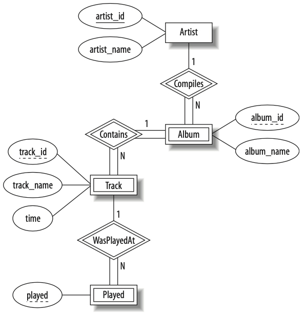

# Fall 2023 Principles of Databases — Assignment 4

* **Do not start this project until you’ve read and understood these instructions. If something is not clear, ask.**

---

## ❖・Introduction・❖

For this assignment, you’ll be revisiting the running music database examples we’ve been using in class. In the first of two steps, you’re going to implement in MySQL the included E/R diagram. And, in the second (and last) step, you’re going to implement a series of commands on the completed MySQL from step 1.

---

## ❖・E/R Diagram Implementation・❖



The E/R diagram above shows a version of the music database we’ve been using as an example in class. The code included in the enclosed `mysql` folder is a partial MySQL implementation of the E/R diagram above.

1. Modify the current instance of the MySQL code in `mysql` to match the E/R diagram, sans relations.
2. Implement the relations `Compiles`, `Contains`, and `WasPlayedAt`.
3. Complete the `Played` entity by matching the first entry to the first track on Dawn of Midi’s _Dysnomia_, the next one to the first track on Interpol’s _Turn on the Bright Lights_, the third one to the first track on The Chrome Cranks’ _Dead Cool_, the fourth one to the first track on The Melvins’ _Houdini_, the fifth and sixth ones to the first track on Mogwai’s _Come on Die Young_ and _Every Country’s Sun_, respectively, and the last one to the first track on Warpaint’s _Heads Up_.
4. Update each relation and/or entity with an `INDEX` on an attribute that you find is most logical.

---

## ❖・Commands・❖

* Using the [CONCAT](https://dev.mysql.com/doc/refman/8.0/en/string-functions.html#function_concat) function, generate the following output:
```bash
+---------------------------------------------+
| Recording                                   |
+---------------------------------------------+
| Dawn of Midi recorded Dysnomia              |
| Interpol recorded Turn on the Bright Lights |
| Melvins recorded Houdini                    |
| Mogwai recorded Come on Die Young           |
| Mogwai recorded Every Country’s Sun         |
| The Chrome Cranks recorded Dead Cool        |
| Warpaint recorded Heads Up                  |
+---------------------------------------------+
```

* Complete the following nested query in order to achieve the following MySQL result: `SELECT artist_name FROM artist WHERE artist_id = ();`. Note that the empty parens is where you’d include the nested query; it’s not a function.

```bash
+-------------------+---------------------------+
| artist_name       | album_name                |
+-------------------+---------------------------+
| Dawn of Midi      | Dysnomia                  |
| Interpol          | Turn on the Bright Lights |
| The Chrome Cranks | Dead Cool                 |
| Melvins           | Houdini                   |
| Mogwai            | Come on Die Young         |
| Mogwai            | Every Country’s Sun       |
| Warpaint          | Heads Up                  |
+-------------------+---------------------------+
```

* Using the relation `Compiles`, write a MySQL command that shows all the albums created by artists, exactly like the output above.

* Using the relation `Contains`, write a MySQL command that shows all the tracks belonging to every album. Ensure you include track name and album name.

* Using the relation `WasPlayedAt`, write a MySQL command that shows all played tracks. Ensure you include track name and track time in your output.

---

## ❖・Rules・❖

* All E/R diagram-related MySQL syntax must go in the `.sql` files within the `mysql` folder.
* All commands must go in `commands.sql` in the root of this repo, each separated by a newline.
* Do not edit any of the `.gitignore` files.
* Do not add more files to this repo; all files required for this project are already included. If you must add one or more files, because you found an error in this assignment’s scaffold, first ask on our class’ Microsoft Group so everyone is aware of the mistake.
* You must use EditorConfig, per the included `.editorconfig` file.

---

## ❖・Due・❖

Wednesday, 20 December 2023, at 5:00 PM.

---

## ❖・Grading・❖

| Item                            | Points |
|---------------------------------|:------:|
| *E/R diagram implementation*    | `25`   |
| *MySQL commands implementation* | `25`   |
| *Syntax quality*                | `25`   |
| *Following instructions*        | `25`   |

---

## ❖・Submission・❖

**NO late submissions will be accepted.**

You will need to issue a pull request back into the original repo, the one from which your fork was created for this project. See the **Issuing Pull Requests** section of [this site](http://code-warrior.github.io/tutorials/git/github/index.html) for help on how to submit your assignment.

**Note**: This assignment may **only** be submitted via GitHub. **No other form of submission will be accepted**.
